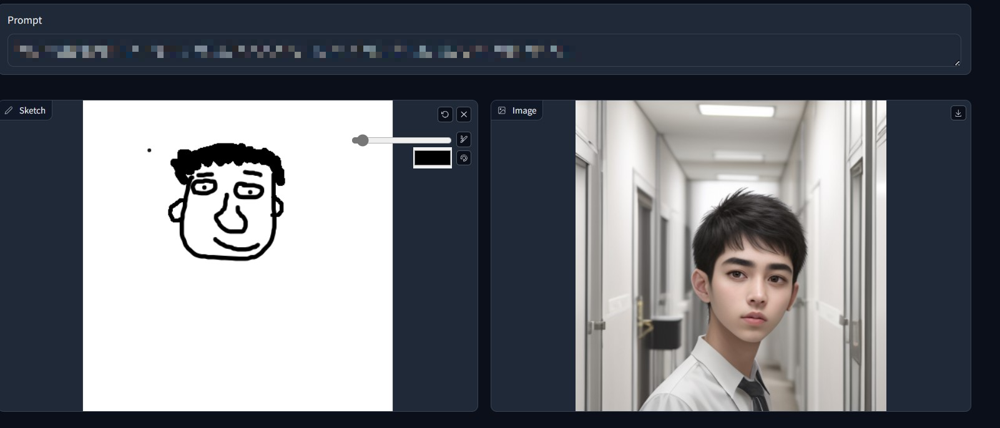
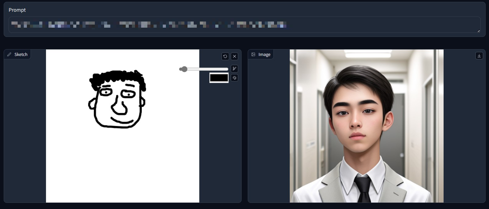

#Real-time-canvas
License: For commercial use, please contact: bito.chan@medsimhealth.com. If you modify the software, you must clearly indicate the modifications made in the modified version and provide the relevant dates. For personal learning/research purposes: You will be free to copy and distribute copies of the software, but you must maintain the integrity of the license document, including the copyright statement and other legal notices.

Main Features: Generates an image within 1 second using basic image-to-image (canvas) functionality and prompts and adjusted the UI interface and modified other image generation models to meet my needs.

Reference: This project is clone by "https://github.com/flowtyone/flowty-realtime-lcm-canvas"   flowty-realtime-lcm-canvas
Source code copy file is in "branches>main"

#即時畫布 
二次創作授權： 商業用途請聯系 bito.chan@medsimhealth.com 如果您對軟件進行修改，您必須在修改後的版本中清楚地標明您對其進行了修改，並提供相關的日期。 個人學習/研究用途， 你將可以自由地複製和分發該軟件副本，但必須保持許可證文檔的完整性，包括許可證的版權聲明和其他法律聲明。

主要功能： 基礎的image-to-image(canvas)以及prompt的作用下，在1秒以內生成一張圖片。並且調整了UI界面和修改了其他圖片生成模型以滿足我的需求。

參考：這個項目是克隆了這個項目 "https://github.com/flowtyone/flowty-realtime-lcm-canvas" flowty-realtime-lcm-canvas 原始碼複製檔案在"branchs>main"
